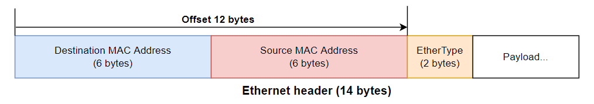

# Day2  - eBPF的前世

> Day 02\
> 原文：[https://ithelp.ithome.com.tw/articles/10292839](https://ithelp.ithome.com.tw/articles/10292839)\
> 發布日期：2022-09-17

要介紹eBPF勢必得先聊聊eBPF的前身 Berkeley Packet Filter (BPF)，BPF最早是在1993年USENIX上發表的一個在類Unix系統上封包擷取的架構。

由於封包會持續不斷的產生，因此在擷取封包時，單一個封包的處理時間可能只有幾豪秒的時間，又封包擷取工具的使用者通常只關注某部分特定的封包，而不會是所有的封包，因此將每個封包都丟到User space來處理是極為低效的行為，因此BPF提出了一種在kernal內完成的封包過濾的方法。

簡單來說，BPF在kernal內加入了一個簡易的虛擬機環境，可以執行BPF定義的指令集，當封包從網卡內進入的時候，就會進到BPF的虛擬機，根據虛擬機的執行結果來決定是否要解取該封包，要的話再送到user space，因此可以直接在kernal過濾掉所有不必要的封包。

大家最常使用的封包過濾工具應該是 `tcpdump` ，tcpdump底下就是基於BPF來完成封包過濾的，tcpdmp使用了libpcap這個library來與kernal的BPF溝通，當我們下達 `tcpdump tcp port 23 host 127.0.0.1` 這樣的過濾規則時，過濾規則會被libpcap編譯成BPC虛擬機可以執行的bpf program，然後載入到kernal的BPF虛擬機，BPF擷取出來的封包也會被libpcap給接收，然後回傳給tcpdump顯示

    tcpdump -d ip

透過 `-d` 這個參數，我們可以看到 `ip` 這個過濾規則會被編譯成怎樣的BPF program

    (000) ldh      [12]
    (001) jeq      #0x800           jt 2    jf 3
    (002) ret      #262144
    (003) ret      #0

- Line 0 `ldh` 指令複製從位移12字節開始的half word (16 bits)到暫存器，對應到ethernet header的ether type欄位。

- Line 1 `jeq` 檢查暫存器數值是否為 `0x0800` (對應到IP的ether type)
  - 是的話，走到Line 2 `return 262144`
  - 不是的話，跳到Line 3 `return 0`
- `ret` 指令結束BPF並根據回傳值決定是不是要擷取該封包，回傳值為0的話表示不要，非0的話則帶表要擷取的封包長度，tcpdump預設指定的擷取長度是262144 bytes。

BPF提供了一個高效、可動態修改的kernal執行環境的概念，這個功能不僅只能用在封包過濾還能夠用在更多地方，因此在Linux kernal 3.18加入了eBPF的功能，提供了一個"通用的" in-kernal 虛擬機。承接了BPF的概念，改進了虛擬機的功能與架構，支援了更多的虛擬機啟動位置，使eBPF可以用在更多功能上。

也因為eBPF做為一個現行更通用更強大的技術，因此現在提及BPF常常指的是eBPF，而傳統的BPF則用classic BPF (cBPF)來代指。

到此我們介紹完了eBPF的前世，明天開始就要進入正題eBPF了。

參考文獻

- <https://www.usenix.org/legacy/publications/library/proceedings/sd93/mccanne.pdf>

- <https://www.tcpdump.org/manpages/pcap_compile.3pcap.html>

- <https://blog.csdn.net/dillanzhou/article/details/96913981>

> 本系列30天鐵人文章同步發表在我的[個人部落格](https://blog.louisif.me/eBPF/Learn-eBPF-Serial-1-Abstract-and-Background/)
