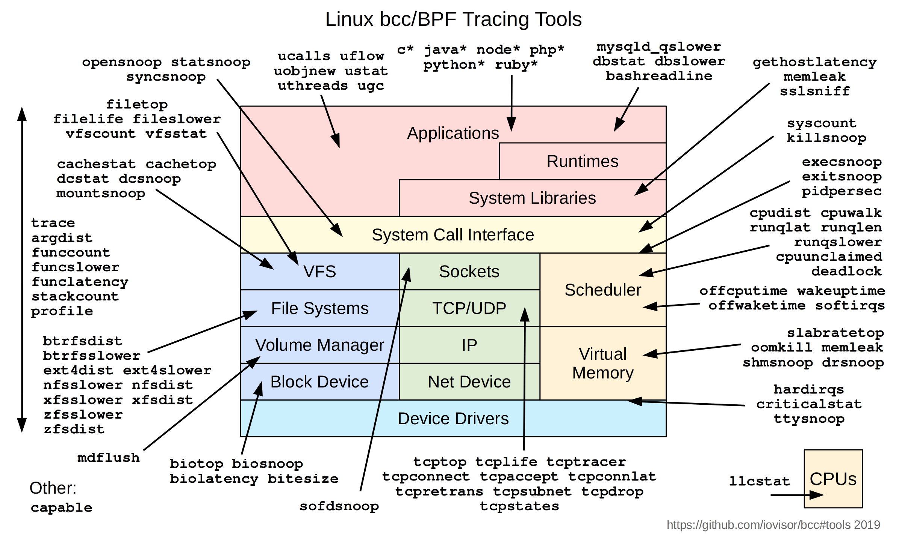

# Day3 - eBPF的應用

> Day 03\
> 原文：[https://ithelp.ithome.com.tw/articles/10292868](https://ithelp.ithome.com.tw/articles/10292868)\
> 發布日期：2022-09-18

今天我們要正式來聊eBPF了!

在介紹BPF的時候，有提到BPF本身就是一個在kernal內的虛擬機。eBPF在kernal的許多功能內埋入了虛擬機的啟動點。例如當kernal執行clone這個system call的時候，就會去檢查有沒有eBPF程式的啟動條件是等待clone這個system call，如果有的話就會調用BPF虛擬機執行eBPF程式，同時把clone相關的資訊帶入到虛擬機。同時虛擬機的執行結果可以控制kernal的後續行為，因此可以透過eBPF做到改變kernal程式進程、數據，擷取kernal執行狀態等功能。

使用eBPF我們可以在不用修改kernal或開發kernal module的情況下，增加kernal的功能，大大了降低了kernal功能開發的難度還有降低對kernal環境版本的依賴。

這邊舉立一些eBPF的用途

- in kernal 的網路處理: 以往在linux上要實作網路封包的處理，通常都會經過整個kernal的network stack，通過iptables(netfilter), ip route等組件的處理。透過eBPF，我們可以在封包進入kernal的早期去直接丟棄非法封包，這樣就不用讓每個封包都要跑完整個network stack，達到提高效能的作用

  - 最知名的應該是Cilium這個CNI專案，基於eBFP提供了整套完整網路、安全、監控的Kubernetees CNI方案。

- kernal tracing: 前面提到eBPF在kernal內的許多地方都埋入了啟動點，因此透過eBPF可以再不用對kernal做任何修改的情況下，很有彈性的監聽分析kernal的執行狀況

  - 下圖是bcc專案使用eBPF開發的一系列Linux監看工具，基本涵蓋了kernal的各個面向。  
    

- 另外一個專安`bpftrace`也提供了一個非常簡單的語法，來產生對應的eBFP tracing code。

- user level tracing: 透過eBFP，我們可以做user level的dynamic tracing，來監看user space應用程式的行為。

  - 一個很有趣的案例是我們可以使用eBPF來做ssl加密連線的監看。SSL/TSL的連線加密通常是在user space應用程式內完成加密的，因此即便我們監看應用程式送入kernal socket的內容，內容也已經是被加密的了。但是要拆解應用程式來查看又相對比較複雜困難，使用eBPF就可以用一個相對簡單的方法來監看加密訊息。
  - 在Linux上，應用程式的加密經常會使用libssl這個library來完成，並使用libssl提供的 `SSL_read` 和 `SSL_write` 取代 socket 的`read`和`write`，透過eBPF的功能，我們可以比較簡單的直接監聽應用程式對這兩個函數的呼叫，並直接提取出未加密的連線內容。

- Security: 前面有講到透過eBFP，我們可以監控system call的呼叫、kernal的執行、user space程式的函數呼叫等等，因此我們也就可以透過eBFP來監控這些事件，並以此檢測程式的安全，拒絕非法的system call呼叫，或異常行為等等。  
  + 詳細可以參考`Tetragon`和`tracee`之類的專案。

上面大概介紹了一些eBFP的應用場景，BPF經過擴展之後，不再侷限於封包過濾這個場景，而在網路處理、内核追蹤、安全監控，等各個方面有了更多可以開發的潛能。

參考文獻

- <https://blog.px.dev/ebpf-openssl-tracing/>
- <https://ebpf.io/applications/>

> 本系列30天鐵人文章同步發表在我的[個人部落格](https://blog.louisif.me/eBPF/Learn-eBPF-Serial-1-Abstract-and-Background/)
