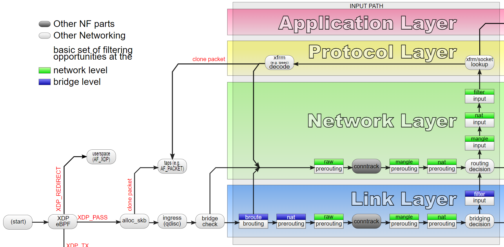

# Day21 - XDP概念

> Day 21\
> 原文：[https://ithelp.ithome.com.tw/articles/10305227](https://ithelp.ithome.com.tw/articles/10305227)\
> 發布日期：2022-10-06

今天讓我們再回到trace BCC的程式碼，這次要看的是`examples/networking/xdp/xdp_redirect_map.py`。

這次程式使用的eBPF program type是`BPF_PROG_TYPE_XDP`，XDP的全稱是eXpress Data Path，雖然作為eBPF子系統的一部分，但由於XDP能夠為提供極高性能又可編程的網路處理，所以非常有名。

在解析今天的程式之前，我們先聊聊XDP相關的概念。

會說linux的網路慢主要是因為封包在進出linux設備時要經過linux kernel的network stack，經過大家熟悉的iptables, routing table..等網路子系統的處理，然而經由這麼多複雜的系統處理就會帶來延遲，降低linux網路的效能。



上圖是封包在經由linux網路子系統到進入路由前的截圖，可以看到在封包剛進入到linux kernel，甚至連前面看過，linux用來維護每一個封包的skb結構都還沒建立前，就會呼叫到XDP eBPF程式，因此如果我們能夠在XDP階段就先過濾掉大量的封包，或封包轉發、改寫，能夠避免掉進入linux網路子系統的整個過程，降低linux處理封包的成本、提高性能。

前面提到XDP工作在封包進入linux kernel的非常早期，甚至早於skb的建立，其實XDP的hook point直接是在driver內，因此XDP是需要driver特別支援的，為此XDP其實有三種工作模式: `xdpdrv`, `xdpgeneric`,`xdpoffload`。  
`xdpdrv`指的是native XDP，就是標準的XDP模式，他的hook point在driver層，因此是網卡接收到封包送至系統的第一位，可以提供極好的網路性能。  
`xdpgeneric`: generic XDP提供一個在skb建立後的XDP進入點，因此可以在driver不支援的情況下提供XDP功能，但也由於該進入點比較晚，所以其實不太能提供好的網路效能，該進入點主要是讓新開發者在缺乏支援網卡的情況下用於測試學習，以及提供driver開發者一個標準用。  
`xdpoffload`: 在某些網卡下，可以將XDP offload到網卡上面執行，由於直接工作在網卡晶片上，因此能夠提供比native XDP還要更好的性能，不過缺點就是需要網卡支援而且部分的map和helper function會無法使用。

XDP的return數值代表了封包的下場，總共有五種結果，定義在xdp_action

``` c
enum xdp_action {
    XDP_ABORTED = 0,
    XDP_DROP,
    XDP_PASS,
    XDP_TX,
    XDP_REDIRECT,
};
```

- XDP_ABORTED, XDP_DROP都代表丟棄封包，因此使用XDP我們可以比較高效的丟棄封包，用於防禦DDoS攻擊。  
  不過XDP_ABORTED同時會產生一個eBPF系統錯誤，可以透過tracepoint機制來查看。

<!-- -->

    echo 1 > /sys/kernel/debug/tracing/events/xdp/xdp_exception/enable
    cat /sys/kernel/debug/tracing/trace_pipe 
    systemd-resolve-512     [000] .Ns.1  5911.288420: xdp_exception: prog_id=91 action=ABORTED ifindex=2
    ...

- XDP_PASS就是正常的讓封包通過不處理。
- XDP_TX是將封包直接從原始網卡送出去，我們可以透過在XDP程式內修改封包內容，來修改目的地IP和MAC，一個使用前景是用於load balancing，可以將封包打到XDP主機，在修改封包送去後端主機。
- XDP_REDIRECT是比較後來新加入的一個功能，它可以將封包
  - 直接轉送到另外一張網路卡，直接送出去
  - 指定給特定的CPU處理
  - 將封包直接送給特定的一個AF_XDP的socket來達到跳過kernel stack直接交由user space處理的效過

最後，前面提到XDP早於skb的建立，因此XDP eBPF program的上下文不是\_\_skb\_\_buff，而是使用自己的`xdp_md`

``` c
struct xdp_md {
    __u32 data;
    __u32 data_end;
    __u32 data_meta;
    /* Below access go through struct xdp_rxq_info */
    __u32 ingress_ifindex; /* rxq->dev->ifindex */
    __u32 rx_queue_index;  /* rxq->queue_index  */
};
```

可以看到xdp_md是一個非常精簡的資料結構，因為linux還沒對其做解析提取出更多資訊。

到此我們講完了XDP的一些基本概念，明天就真的進到程式碼了!

> 本系列30天鐵人文章同步發表在我的[個人部落格](https://blog.louisif.me/eBPF/Learn-eBPF-Serial-1-Abstract-and-Background/)
