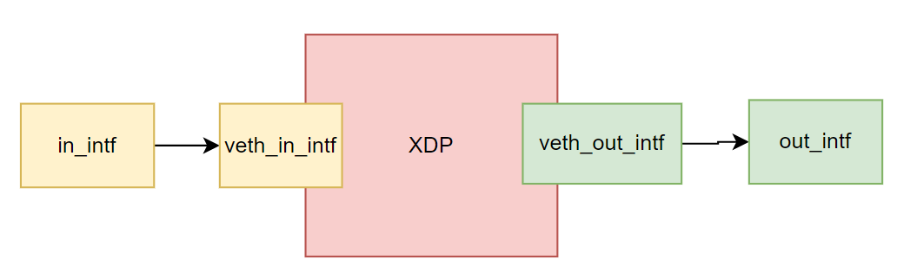

# Day22 - BCC xdp_redirect_map

> Day 22\
> 原文：[https://ithelp.ithome.com.tw/articles/10305548](https://ithelp.ithome.com.tw/articles/10305548)\
> 發布日期：2022-10-07

接續昨天的內容，今天正式來看看`examples/networking/xdp/xdp_redirect_map.py`

這隻程式的功能很簡單，執行時指定兩個interface `in_intf`和`out_intf`，所有從`in_intf`進入的封包會直接從`out_intf`送出去，並且交換src mac address和dst mac address，同時記錄每秒鐘通過該介面的封包個數。

從out_intf進入的封包則正常交給linux network系統處理。  
  
首先我們一樣要先驗證程式的執行，首先建立一個network namespace net0。然後把兩個網卡`veth_in_intf`, `veth_out_intf`放進去，作為xdp_redirect_map使用的網卡。為了方便打流量，我們幫`in_intf`指定一個ip 10.10.10.1，並幫加入一個不存在的遠端ip 10.10.10.2，接著我們就可以透過ping 10.10.10.2來從in_intf打流量，透過tcpdump捕捉out_intf的封包，應該就可以看到從10.10.10.1過來的封包，同時mac address被交換了，所以可以看到src mac 變成ee:11:ee:11:ee:11。

    ip netns add net0
    ip link add in_intf type veth peer name veth_in_intf
    ip link add out_intf type veth peer name veth_out_intf
    ip link set veth_in_intf netns net0
    ip link set veth_out_intf netns net0
    ip link set in_intf up
    ip link set out_intf up
    ip netns exec net0 ip link set veth_in_intf up
    ip netns exec net0 ip link set veth_out_intf up
    ip address add 10.10.10.1/24 dev in_intf
    ip neigh add 10.10.10.2 lladdr ee:11:ee:11:ee:11 dev in_intf

> 目前這個部分其實沒有驗證成功，雖然根據xdp redirect的log，封包是真的有成功被轉送到veth_out_intf的，然後透過tcpdump卻沒有在out_intf上收到封包，可惜的是具體原因沒能確定。

這次的程式非常簡短，首先是一個swap_src_dst_mac函數，用於交換封包的src mac address和dst mac address。

``` c
static inline void swap_src_dst_mac(void *data)
{
    unsigned short *p = data;
    unsigned short dst[3];
    dst[0] = p[0];
    dst[1] = p[1];
    dst[2] = p[2];
    p[0] = p[3];
    p[1] = p[4];
    p[2] = p[5];
    p[3] = dst[0];
    p[4] = dst[1];
    p[5] = dst[2];
}
```

由於mac address在ethernet header的前12個bit所以可以很簡單地進行交換。

接著就直接進入到了attach在in interface上的XDP函數

``` c
int xdp_redirect_map(struct xdp_md *ctx) {
    void* data_end = (void*)(long)ctx->data_end;
    void* data = (void*)(long)ctx->data;
    struct ethhdr *eth = data;
    uint32_t key = 0;
    long *value;
    uint64_t nh_off;
    nh_off = sizeof(*eth);
    if (data + nh_off  > data_end)
        return XDP_DROP;
    value = rxcnt.lookup(&key);
    if (value)
        *value += 1;
    swap_src_dst_mac(data);
    return tx_port.redirect_map(0, 0);
}
```

首先data及data_end是分別指到封包頭尾的指標，由於封包頭都是ethernet header，因此可以直接將data轉成`ethhdr`指標。  
首先對ethernet封包做一個完整性檢查，`data + nh_off > data_end`表示封包大小小於一個ethernet header，表示封包表示不完整，就直接將封包透過`XDP_DROP`丟棄。

接著`rxcxt`是預先定義的一個 `BPF_PERCPU_ARRAY(rxcnt, long, 1);`，PER_CPU map的特性是每顆CPU上都會保有一份獨立不同步的資料，因此可以避免cpu之間的race condition，減少lock的開銷。  
這邊指定每個CPU上的array長度為1，可以參考Day11有介紹過，是一個特別的使用技巧，可以簡單看成一個可以跟user space share的全域變數。

``` c
uint32_t key = 0;
value = rxcnt.lookup(&key);
if (value)
    *value += 1;
    
```

這邊的用途是用來統計經過的封包個數，因此這邊非常簡單，統一使用0當作key去存取唯一的value，然後每經過一個封包就將value加一，這邊可以注意到lookup回傳的是pointer，因此可以直接對他做修改即可保存。

``` c
swap_src_dst_mac(data);
return tx_port.redirect_map(0, 0);
```

最後會呼叫`swap_src_dst_mac`來交換封包，然後透過`redirect_map`來將封包送到對應的out interface。

BPF_MAP_TYPE_DEVMAP和BPF_MAP_TYPE_CUPMAP是用來搭配XDP_REDIRECT，將封包導向透定的CPU或著從其他interface送出去的。

而這邊的redirect_map在編譯時會被修改為呼叫bpf_redirect_map這個helper function。其定義為`long bpf_redirect_map(struct bpf_map *map, u32 key, u64 flags)`，透過接收map可以根據對應到的value來將封包導向到interface或著CPU，設置方法會在後面的python code介紹。  
由於我們今天只為有一個out interface，因此可以很簡單的指定key為0

後面的flags目前只有使用最後兩個bit，可以當作key找不到時redirect_map的回傳值，因此以本次的code來說，預設的回傳數值是0，也就對應到XDP_ABORTED。

``` c
int xdp_dummy(struct xdp_md *ctx) {
    return XDP_PASS;
}
```

最後一段程式碼`xdp_dummy`是用來皆在out interface上的XDP程式，但他就只是簡單的`XDP_PASS`，讓進入的封包繼續交由linux kernel來處理。

接下來就進入到python code的部分

``` python
in_if = sys.argv[1]
out_if = sys.argv[2]

ip = pyroute2.IPRoute()
out_idx = ip.link_lookup(ifname=out_if)[0]
```

首先將兩張網卡的名稱讀進來，接著透過pyroute2的工具去找到out interface的ifindex

``` python
tx_port = b.get_table("tx_port")
tx_port[0] = ct.c_int(out_idx)
```

接著是設定tx_port這張DEVMAP的key 0為out interface的index，因此所有經過eBPF程式的封包都會丟到out interface

``` python
in_fn = b.load_func("xdp_redirect_map", BPF.XDP)
out_fn = b.load_func("xdp_dummy", BPF.XDP)
b.attach_xdp(in_if, in_fn, flags)
b.attach_xdp(out_if, out_fn, flags)
```

接著就是將eBPF程式attach到兩張網卡上

``` python
rxcnt = b.get_table("rxcnt")
prev = 0
while 1:
    val = rxcnt.sum(0).value
    if val:
        delta = val - prev
        prev = val
        print("{} pkt/s".format(delta))
    time.sleep(1)
```

將eBPF程式attach上去之後就完成了封包重導向的工作，剩下的部分是用來統計每秒鐘經過的封包的，這邊的做法很簡單，每秒鐘都去紀錄一次通過封包總量和前一秒鐘的差異就可以算出來這一秒內經過的封包數量。  
這邊比較特別的是`rxcnt.sum`，前面提到rxcnt是一個per cpu的map，因此這邊使用sum函數將每顆cpu的key 0直接相加起來，就可以得到經過所有CPU的封包總量。

> 本系列30天鐵人文章同步發表在我的[個人部落格](https://blog.louisif.me/eBPF/Learn-eBPF-Serial-1-Abstract-and-Background/)
