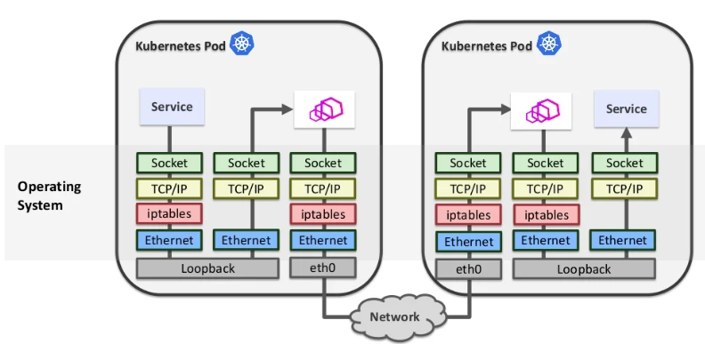
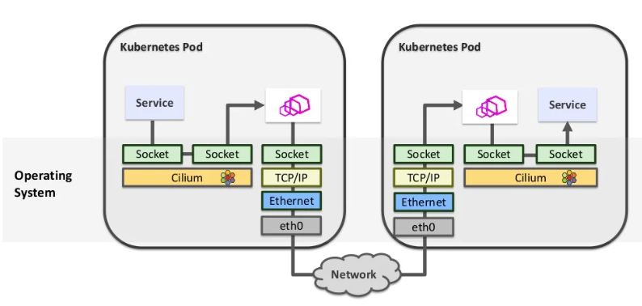

# Day27 - BCC sockmap (上)

> Day 27\
> 原文：[https://ithelp.ithome.com.tw/articles/10307797](https://ithelp.ithome.com.tw/articles/10307797)\
> 發布日期：2022-10-12

完成了昨天對cgroups的介紹，今天我們正式來介紹`examples/networking/sockmap.py`這隻程式。([原始碼](https://github.com/iovisor/bcc/blob/master/examples/networking/sockmap.py))

首先我們一樣先來了解一下sockmap的功能。這邊我們拿Cilium CNI[介紹](https://www.slideshare.net/ThomasGraf5/accelerating-envoy-and-istio-with-cilium-and-the-linux-kernel)的一張圖來說明。  
  
圖中是一個使用envoy sidecar的kubernetes pod網路連線示意圖，簡單來說kubernetes上面容器(Pod)服務(Service)的網路流量會透過iptables的機制全部重新導向到跑在同一個容器內的sidecar，透過sidecar當作中介完成網路監控、服務發現等功能後才會真正離開容器。進入容器的流量同樣先都重導向到sidecar處理。

這樣的好處是可以完全不對service本身修改，完全由獨立的sidecar來提供附加的網路功能，但是也有一個很明顯的問題，一個封包在傳輸的過程中，要經過3次Linux kernel的network stack處理，大大降低了封包的傳輸效率。

其中由於都是在同一台設備的同一個網路空間內傳輸，因此TPC/IP/ethernet等底層網路完全可以省略。

  
因此我們可以透過eBPF的socket redirect技術來簡化這個封包的傳輸過程，簡單來說，在同一個設備的兩個socket間的傳輸，我們完全可以直接跳過底層的網路堆疊，直接在socket layer將封包內容從一個socket搬到另外一個socket，跳過底層TCP/IP/ethernet處理。

讓我們回到bcc的`sockmap.py`，他提供的就是socket redirect的功能，他會監聽機器上的所有socket，將local to local的tcp連線資料封包直接透過socket redirect的方式進行搬運。

> socket redirect機制好像同時也節省了packet在userspace和kernel space之間複製搬運的過程，不過這件事情沒有完全確定。

我們一樣先看看執行起來怎麼樣，我們透過python建立一個http server並透過curl來測試

``` shell
python3 -m http.server &
curl 127.0.0.1:8000
```

接著是eBPF程式的執行解果

    python3 sockmap.py -c /sys/fs/cgroup/unified/
    b'curl-3043    [000] d...1  7164.673950: bpf_trace_printk: remote-port: 8000, local-port: 46246'
    b'curl-3043    [000] dN..1  7164.673973: bpf_trace_printk: Sockhash op: 4, port 46246 --> 8000'
    b'curl-3043    [000] dNs11  7164.673985: bpf_trace_printk: remote-port: 46246, local-port: 8000'
    b'curl-3043    [000] dNs11  7164.673988: bpf_trace_printk: Sockhash op: 5, port 8000 --> 46246'
    b'curl-3043    [000] d...1  7164.674643: bpf_trace_printk: try redirect port 46246 --> 8000'
    b'python3-3044    [000] d...1  7164.675211: bpf_trace_printk: try redirect port 8000 --> 46246'
    b'python3-3044    [000] d...1  7164.675492: bpf_trace_printk: try redirect port 8000 --> 46246'

> 這邊可以看到sockmap要指定一個-c的參數，後面是指定一個cgroup，sockmap只會監控在這個cgroup節點上的socket連線。這邊unified是cgroup v2的hierarchy，在cgroup v2只有unified一個hierarchy，所有subsystem都在這個hierarchy上。

首先是 `curl remote-port: 8000, local-port: 46246' Sockhash op: 4, port 46246 --> 8000'`，這兩條是curl發起連線時，記錄下來的socket連線請求。

接著`curl remote-port: 46246, local-port: 8000' Sockhash op: 5, port 8000 --> 46246'`，是curl跟http server之間連線建立成功後，返回給curl的socket通知。

接著可以看到3條`try redirect`是curl傳遞http request和http server返回http response的msg，直接透過socket redirect的方式在兩個socket之間交互。

這邊我們使用tcpdump去監聽`lo` interface的方式來驗證socket redirect有真的運作到。同樣是透過`curl 127.0.0.1:8000`發起連線傳輸資料。在沒有啟用sockmap的情況下tcpdump捕捉到12個封包。而開啟socketmap後只會捕捉到6個封包。

透過封包內容會發現，在socketmap啟動後，只能夠捕捉到帶`SYN`、`FIN`等flag的TCP控制封包，不會捕捉到中間純粹的資料交換封包。

完成驗證後，我們接著來介紹這次用到的兩種eBPG program type，分別是`BPF_PROG_TYPE_SOCK_OPS`和`BPF_PROG_TYPE_SK_MSG`。

`BPF_PROG_TYPE_SOCK_OPS`可以attach在一個cgroup節點上，當該節點上任意process的socket發生特定事件時，該eBPF program會被觸發。可能的事件定義在[bpf.h](https://elixir.bootlin.com/linux/v6.0/source/include/uapi/linux/bpf.h)。其中CB結尾的表示特定事件完成後觸發，例如`BPF_SOCK_OPS_TCP_LISTEN_CB`表示在socket tcp連線轉乘LISTEN狀態後觸發。有些則是觸發來透過回傳值設置一些控制項，`BPF_SOCK_OPS_TIMEOUT_INIT`是在TCP Timeout後觸發，透過eBPF 的return value設置RTO，-1表示使用系統預設。

``` c
enum {
    BPF_SOCK_OPS_VOID,
    BPF_SOCK_OPS_TIMEOUT_INIT,  
    BPF_SOCK_OPS_RWND_INIT, 
    BPF_SOCK_OPS_TCP_CONNECT_CB,
    BPF_SOCK_OPS_ACTIVE_ESTABLISHED_CB, 
    BPF_SOCK_OPS_PASSIVE_ESTABLISHED_CB,
    BPF_SOCK_OPS_NEEDS_ECN, 
    BPF_SOCK_OPS_BASE_RTT,
    BPF_SOCK_OPS_RTO_CB,
    BPF_SOCK_OPS_RETRANS_CB,
    BPF_SOCK_OPS_STATE_CB,  
    BPF_SOCK_OPS_TCP_LISTEN_CB,
    BPF_SOCK_OPS_RTT_CB,
    BPF_SOCK_OPS_PARSE_HDR_OPT_CB,  
    BPF_SOCK_OPS_HDR_OPT_LEN_CB,
    BPF_SOCK_OPS_WRITE_HDR_OPT_CB,  
};
```

這邊要特別介紹的是`BPF_SOCK_OPS_ACTIVE_ESTABLISHED_CB`和`BPF_SOCK_OPS_PASSIVE_ESTABLISHED_CB`分別是在主動建立連線時(發送SYN，tcp三手交握第一手)，和被動建立連線時(發送SYN+ACK，tcp三手交握第二手)觸發。

觸發後會拿到bpf_sock_ops上下文，並根據事件不同，eBPF回傳值也代表不同的意義。其中`bpf_sock_ops->op`對應到上述的事件類型。args則是不同op可能帶的一些特殊參數。

``` c
struct bpf_sock_ops {
    __u32 op;
    union {
        __u32 args[4];      /* Optionally passed to bpf program */
        __u32 reply;        /* Returned by bpf program      */
        __u32 replylong[4]; /* Optionally returned by bpf prog  */
    };
    __u32 family;
    __u32 remote_ip4;   /* Stored in network byte order */
    __u32 local_ip4;    /* Stored in network byte order */
    __u32 remote_ip6[4];    /* Stored in network byte order */
    __u32 local_ip6[4]; /* Stored in network byte order */
    __u32 remote_port;  /* Stored in network byte order */
    __u32 local_port;   /* stored in host byte order */
    __u32 is_fullsock;
    ...
```

今天我們介紹了socket redirect的概念還有用到的其中一個program type，明天我們會介紹另外一個program type `BPF_PROG_TYPE_SK_MSG`並實際看sockmap的程式碼實作。

> 本系列30天鐵人文章同步發表在我的[個人部落格](https://blog.louisif.me/eBPF/Learn-eBPF-Serial-1-Abstract-and-Background/)
